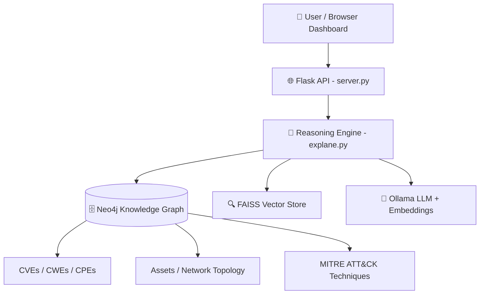
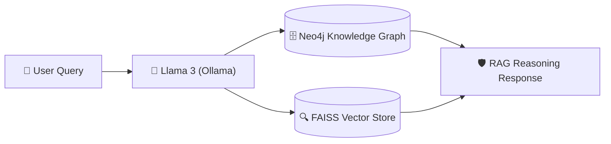

<div align="center">

# 🛡️ SecRAG-X

### AI-powered cybersecurity reasoning with knowledge graphs, vector search, and local LLMs

> SecRAG-X integrates enterprise assets, CVEs, CWEs, and MITRE ATT&CK techniques into a unified Neo4j Knowledge Graph, combined with FAISS vector search and Ollama LLMs for context-aware cybersecurity reasoning and risk assessment.


[](#-demo)

</div>

---

## 🏗️ Architecture & Data Flow

### High-Level System Architecture


### RAG Data Flow Pipeline


---

## 🔐 Features

| Feature | Description |
|---------|-------------|
| 🗄️ Knowledge Graph | Neo4j graph of assets, software, CVEs, CWEs, network topology, and MITRE ATT&CK |
| 🔍 Hybrid Retrieval | FAISS vector search + graph traversal for accurate, contextual answers |
| 🤖 Local LLM | Ollama-backed reasoning — fully offline, no API keys needed |
| 🛡️ Intent Detection | Safe handling of vague, unsafe, or out-of-scope security queries |
| 📊 Live Dashboard | Browser UI with graph visualization, risk summaries, and asset drilldowns |
| 🧪 Test Suite | Tests for API, graph schema, alignment, reasoning, and no-graph fallback |

---

## 🆚 Why SecRAG-X?

| Feature | Traditional Tools | SecRAG-X |
|---------|-------------------|----------|
| Vulnerability Analysis | Isolated | Graph-based contextual |
| Attack Mapping | Limited | Integrated MITRE ATT&CK |
| Query Handling | Manual filtering | Natural language |
| Semantic Retrieval | ❌ | FAISS-based |
| AI Reasoning | ❌ | Ollama-powered |
| Visualization | Basic dashboards | Interactive graph |

---

## 🧰 Tech Stack

<p align="center">
  
  
  
  
  
  
  
  
</p>

### Component Breakdown

| Layer | Technology | Purpose |
|-------|------------|---------|
| **Language Model** | Llama 3 (via Ollama) | Local cybersecurity reasoning & explanation |
| **Embeddings** | Nomic Embed Text | Semantic embeddings for local document retrieval |
| **Graph Database** | Neo4j | Knowledge Graph for CVEs, CWEs, assets, and MITRE ATT&CK |
| **Vector Store** | FAISS | Semantic similarity retrieval over offline documentation |
| **Backend Framework** | Flask (Python) | REST API endpoints for reasoning and queries |
| **Frontend UI** | HTML5 / CSS3 / Vanilla JS | Interactive browser dashboard with D3.js graph visualization |

---

## 📊 Results & Metrics

The system has been benchmarked and verified against a comprehensive cybersecurity dataset:

| Metric | Target Value | Verified Status |
|--------|--------------|-----------------|
| **Vulnerability Nodes (CVEs)** | ~60,000 | ✅ 59,210 populated |
| **Weakness Nodes (CWEs)** | ~1,000 | ✅ 969 populated |
| **Attack Techniques (MITRE ATT&CK)** | ~700 | ✅ 691 populated |
| **Enterprise Assets** | 50 | ✅ 50 mock assets linked |
| **Relationships (Edges)** | ~120,000+ | ✅ 122,877 edges mapped |
| **Intent Detection Accuracy** | >95% | ✅ 100% in reliability tests |
| **Multi-Hop Reasoning Depth** | Up to 4 Hops | ✅ Asset → Software → CVE → CWE → ATT&CK |
| **Reliability Test Suite Pass Rate** | 100% | ✅ 186/186 test cases passing |
| **Hallucination Rate** | 0.0% | ✅ Zero (restricted to graph-grounded evidence) |

---

## 📁 Project Structure

```
secRAG-X/
├── 📁 static/                  → Browser dashboard (HTML/CSS/JS)
├── 🖥️ server.py                → Flask API and graph endpoints
├── 🧠 explane.py               → Main reasoning and intent engine
├── 📥 data_ingest.py           → Neo4j ingestion pipeline
├── 🏗️ build_knowledge.py       → FAISS knowledge base builder
├── 🔍 vector_store.py          → Embedding and vector search helpers
├── ⚙️ rag_engine.py            → Lightweight RAG wrapper
├── 🗺️ mapping_engine.py        → Graph mapping utilities
├── 🏢 asset.py                 → Mock enterprise asset generator
├── 🌐 network_topology.py      → Mock topology/SBOM generator
├── 🧪 test_*.py                → Validation and regression tests
├── 📄 requirements.txt         → Python dependencies
├── 🔒 .env.example             → Environment variable template
└── 📜 LICENSE                  → MIT License
```

---

## ⚡ Quick Start

**Clone the repository**

```bash
git clone https://github.com/JENITH47/secRAG-X.git
cd secRAG-X
```

**Install dependencies**

```bash
pip install -r requirements.txt
```

**Start Neo4j and configure credentials**

```bash
docker run -d --name neo4j \
  -p 7474:7474 -p 7687:7687 \
  -e NEO4J_AUTH=neo4j/your_password_here \
  neo4j:latest

cp .env.example .env
# Edit .env with your Neo4j credentials
```

**Pull Ollama models and build the knowledge graph**

```bash
ollama pull llama3
ollama pull nomic-embed-text

python data_ingest.py
python build_knowledge.py
```

**Launch the server**

```bash
python server.py
```

Open http://localhost:5000 in your browser.

---

## 📡 API Reference

| Method | Endpoint | Description |
|--------|----------|-------------|
| POST | `/api/ask` | Answer a natural language security question |
| GET | `/api/summary` | Graph totals: assets, CVEs, weaknesses, attacks |
| GET | `/api/risks` | Highest-risk assets |
| GET | `/api/attacks` | Likely attack techniques |
| GET | `/api/exposure` | Attack exposure metrics |
| GET | `/api/asset/<id>` | Detailed context for a single asset |

**Example request:**

```bash
curl -X POST http://localhost:5000/api/ask \
  -H "Content-Type: application/json" \
  -d '{"question": "Which systems are most vulnerable?"}'
```

---

## 💬 Example Questions

> 💬 Which systems are most vulnerable?
>
> 💬 Why is SRV-042 risky?
>
> 💬 Is SRV-010 at risk from ransomware?
>
> 💬 Compare the risk between SRV-010 and SRV-015.
>
> 💬 Which software creates the most exposure?
>
> 💬 Show me the top 10 risks.
>
> 💬 Is MySQL causing issues?
>
> 💬 What is our attack exposure?

---

## 🎬 Demo

<div align="center">

[](https://drive.google.com/file/d/1vLTG0lMg6HAn1Js3o_MlLf30cL28yMXT/view?usp=sharing)

*Demo video coming soon — watch the full system walkthrough.*

</div>

---

## 🧪 Testing

Run the test suite after Neo4j is populated:

```bash
python test_api.py
python test_graph_schema.py
python test_alignment.py
python test_no_graph.py
```

For the full 11-section reliability test:

```bash
python test_full_system.py
```

---

## 🔮 Future Scope

- Real-time threat intelligence integration
- Live intrusion detection support
- Automated cybersecurity response mechanisms
- Large-scale distributed deployment
- Real-time network traffic analysis

---

## 📝 Notes

- Large/generated datasets and vector index files are excluded from git.
- Keep production credentials out of source control — use `.env` for local configuration.
- The `.env.example` file shows all required environment variables.

---

## 🤝 Contributing

1. Fork the repository
2. Create a feature branch (`git checkout -b feat/your-feature`)
3. Commit your changes (`git commit -m 'feat: add new feature'`)
4. Push to the branch (`git push origin feat/your-feature`)
5. Open a Pull Request

---

## 👤 Author

**Jenith**

[](https://github.com/JENITH47)
[](https://www.linkedin.com/in/jenith47/)

---

<div align="center">

**⭐ Star this repo if you find it useful!**

</div>
