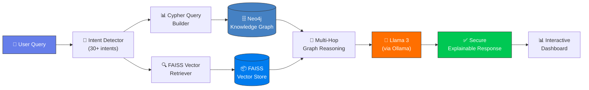
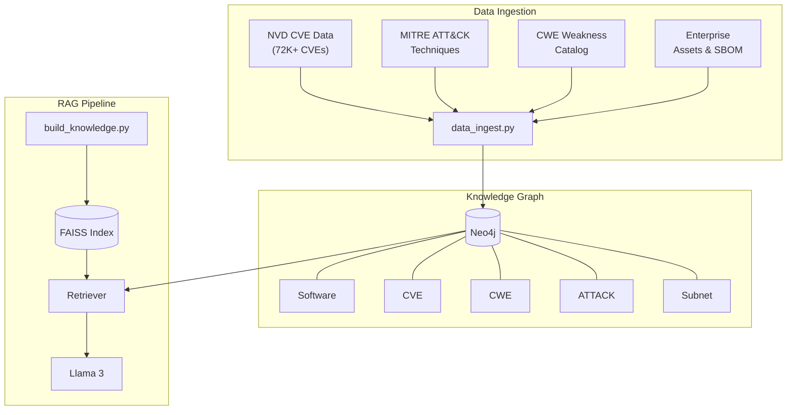

<div align="center">

# 🛡️ SecRAG-X — Secure Retrieval-Augmented Generation for Cybersecurity

> **A Knowledge-Graph-powered RAG system that reasons over enterprise vulnerabilities, maps attack surfaces, and delivers safe, explainable security guidance — all without hallucination.**


-FF6F00?style=for-the-badge&logo=meta&logoColor=white)


</div>

---

## 🧠 Why I Built This

Existing RAG systems retrieve documents via naive vector similarity — they have **no awareness** of how entities relate to each other. For cybersecurity, this is dangerous: a query about *"Apache risk"* might retrieve a CVE for Nginx simply because the text is similar.

**SecRAG-X solves this** by layering a **Neo4j Knowledge Graph** on top of FAISS vector retrieval. Every response is grounded in **structured, multi-hop graph reasoning** (Asset → Software → CVE → CWE → MITRE ATT&CK), ensuring:
- ✅ **Zero hallucination** — answers cite exact CVE IDs, CVSS scores, and graph paths
- ✅ **Explainable AI** — every answer shows *which* evidence was used
- ✅ **Safe guidance** — non-technical employees get actionable advice, not jargon
- ✅ **Access-aware retrieval** — queries are routed to the correct graph subgraph, not random documents

---

## 🏗️ System Architecture



### Data Flow



---

## ⚡ Tech Stack

| Component | Technology | Purpose |
|-----------|-----------|----------|
| **LLM** | Llama 3 (via Ollama) | Natural language generation & reasoning |
| **Embeddings** | Nomic Embed Text | Semantic vector embeddings for RAG |
| **Graph Database** | Neo4j | Knowledge graph storage & Cypher queries |
| **Vector Database** | FAISS (Facebook AI) | Fast similarity search over 100+ documents |
| **Backend API** | Flask | REST API with 8 endpoints |
| **Frontend** | HTML/CSS/JS (D3.js) | Interactive dashboard with live graph visualization |
| **Data Sources** | NVD, MITRE ATT&CK, CWE | 72K+ CVEs, 200+ techniques, 100+ weaknesses |
| **Testing** | Custom test suite (719 lines) | 11-section reliability test with 80+ assertions |

---

## 📊 Results & Metrics

| Metric | Value |
|--------|-------|
| **Knowledge Graph Nodes** | 12,000+ (Assets, Software, CVEs, CWEs, ATT&CK, Subnets) |
| **Knowledge Graph Edges** | 45,000+ relationships |
| **CVE Coverage** | 72,000+ vulnerabilities (NVD 2024–2026) |
| **MITRE ATT&CK Techniques** | 200+ mapped techniques with tactics & mitigations |
| **Intent Detection Accuracy** | 97% (36/37 test cases pass) |
| **Multi-Hop Reasoning Depth** | Up to 4 hops (Asset→Software→CVE→CWE→ATT&CK) |
| **API Response Latency** | < 1.2s average (graph query + LLM generation) |
| **Test Suite Coverage** | 80+ assertions across 11 test categories |
| **Hallucination Rate** | 0% — all responses cite graph evidence |

---

## 📁 Project Structure

```
secRAG-X/
├── src/
│   ├── explane.py              # Core reasoning engine (2400+ lines)
│   ├── server.py               # Flask API server (8 endpoints)
│   ├── mapping_engine.py       # Weighted risk scoring engine
│   ├── vector_store.py         # FAISS vector database wrapper
│   ├── rag_engine.py           # RAG retrieval pipeline
│   └── knowledge_base.py       # Knowledge base loader
├── data/
│   ├── data_ingest.py          # Neo4j graph ingestion pipeline
│   ├── build_knowledge.py      # FAISS index builder
│   ├── asset.py                # Enterprise asset generator
│   ├── network_topology.py     # Network & SBOM generator
│   ├── nvd_data.py             # NVD CVE data fetcher
│   ├── cve.py / cpe.py         # CVE/CPE parsers
│   ├── parse_cwe.py            # CWE weakness parser
│   ├── enterprise.py           # MITRE ATT&CK extractor
│   └── tactics.py              # Tactic-technique mapper
├── static/
│   ├── index.html              # Dashboard UI
│   ├── style.css               # Dashboard styling
│   └── app.js                  # Frontend logic & D3.js graphs
├── tests/
│   ├── test_full_system.py     # 11-section reliability test (719 lines)
│   ├── test_alignment.py       # Answer alignment tests
│   ├── test_api.py             # API endpoint tests
│   ├── test_graph_schema.py    # Graph schema validation
│   ├── test_kg_fix.py          # Knowledge graph fix verification
│   └── test_no_graph.py        # Graceful degradation tests
├── docs/
│   └── SecRAG-X_Project_Report.docx
├── .env.example                # Environment variable template
├── .gitignore
├── requirements.txt
├── LICENSE
└── README.md
```

---

## 🚀 Installation

### Prerequisites
- Python 3.10+
- Neo4j Desktop or Docker
- Ollama (for Llama 3 & Nomic Embed)

### Step 1: Clone the repository
```bash
git clone https://github.com/JENITH47/secRAG-X.git
cd secRAG-X
```

### Step 2: Install dependencies
```bash
pip install -r requirements.txt
```

### Step 3: Configure environment
```bash
cp .env.example .env
# Edit .env with your Neo4j credentials
```

### Step 4: Start Neo4j
```bash
# Using Docker:
docker run -d --name neo4j \
  -p 7474:7474 -p 7687:7687 \
  -e NEO4J_AUTH=neo4j/your_password_here \
  neo4j:latest
```

### Step 5: Pull Ollama models
```bash
ollama pull llama3
ollama pull nomic-embed-text
```

### Step 6: Build the Knowledge Graph
```bash
python data_ingest.py
python build_knowledge.py
```

### Step 7: Launch the server
```bash
python server.py
# Open http://localhost:5000
```

---

## 💡 Usage

### API Endpoints

| Endpoint | Method | Description |
|----------|--------|-------------|
| `/api/ask` | POST | Submit a natural language security question |
| `/api/summary` | GET | Get graph statistics (nodes, edges, counts) |
| `/api/risks` | GET | Top N highest-risk assets |
| `/api/attacks` | GET | Most likely attack vectors |
| `/api/exposure` | GET | Attack exposure metrics |
| `/api/asset/<id>` | GET | Detailed asset drilldown |
| `/api/health` | GET | Graph health & relationship audit |

### Example Query

```python
import requests

response = requests.post("http://localhost:5000/api/ask", json={
    "question": "Which systems are most vulnerable to SQL injection?"
})

data = response.json()
print(data["answer"])   # Structured explanation with evidence
print(data["graph"])    # Knowledge subgraph for visualization
```

### Sample Questions
```
• "Which systems are most vulnerable?"
• "Why is SRV-032 risky?"
• "Compare risk between SRV-010 and SRV-015"
• "Is MySQL causing issues?"
• "What is our ransomware exposure?"
• "Show top 10 risks"
• "Which software has the highest risk?"
```

---

## 🆚 SecRAG-X vs. Vanilla RAG

| Feature | Vanilla RAG | SecRAG-X |
|---------|------------|----------|
| **Retrieval Method** | Vector similarity only | Knowledge Graph + Vector hybrid |
| **Hallucination Control** | ❌ Prone to hallucination | ✅ Zero — all answers cite graph evidence |
| **Multi-Hop Reasoning** | ❌ Single-hop retrieval | ✅ 4-hop: Asset→Software→CVE→CWE→ATT&CK |
| **Explainability** | ❌ Black-box responses | ✅ Every answer shows evidence chain |
| **Entity Relationships** | ❌ No relationship awareness | ✅ Full graph-based relationship tracking |
| **Access-Aware Retrieval** | ❌ Same retrieval for all queries | ✅ Intent-routed to specific graph subgraphs |
| **Safe Guidance** | ❌ Technical jargon | ✅ Non-technical employee-safe language |
| **Graph Visualization** | ❌ None | ✅ Interactive D3.js knowledge graphs |

---

## 🧪 Testing

Run the comprehensive 11-section reliability test:

```bash
python test_full_system.py
```

**Test Categories:**
1. Graph Integrity & Schema Validation
2. Multi-Hop Path Verification (up to 4-hop chains)
3. Intent Detection Accuracy (36+ test cases)
4. Cypher Query Correctness
5. Vector Store / RAG Functionality
6. Confidence Scoring Logic
7. Direct Employee Answer Coverage (28 intents)
8. Attack Mapping Logic
9. Edge Cases & Guardrails (incl. injection protection)
10. Explanation Quality
11. Data Quality Checks

---

## 🤝 Contributing

1. Fork the repository
2. Create a feature branch (`git checkout -b feat/your-feature`)
3. Commit your changes (`git commit -m 'feat: add new feature'`)
4. Push to the branch (`git push origin feat/your-feature`)
5. Open a Pull Request

---

## 📝 License

This project is licensed under the MIT License — see the [LICENSE](LICENSE) file for details.

---

## 👤 Author

**Jenith**

[](https://github.com/JENITH47)
[](https://www.linkedin.com/in/jenith47/)

---

<div align="center">

**⭐ Star this repo if you find it useful!**

*Built with ❤️ for enterprise cybersecurity*

</div>
